# AWS Architecture Guide For Web, Kubernetes, Serverless, And AWS-GCP Hybrid Systems

Date: 2026-06-19

This guide explains how to design AWS architectures for:

1. Classic 3-tier web applications.
2. Web applications served by Kubernetes on Amazon EKS.
3. EKS web applications integrated with AWS Lambda and other managed services.
4. EKS + Lambda applications integrated with Google Cloud services such as BigQuery and Cloud Run functions.

It also explains the networking pieces that make these architectures work: VPCs, subnets, route tables, internet gateways, NAT gateways, VPC endpoints, Transit Gateway, Direct Connect, VPN, DNS, load balancing, security controls, observability, and deployment patterns.

The goal is not to memorize every AWS service. The goal is to understand the building blocks well enough that a production architecture diagram stops looking like a bowl of alphabet soup.

## 1. First Principles

Most production AWS web architectures are variations of the same pattern:

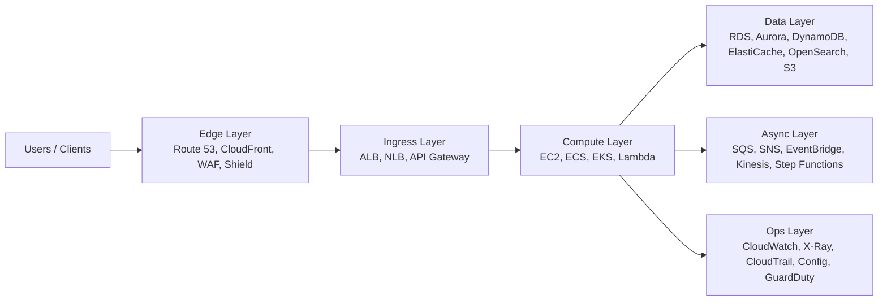


The exact implementation changes, but the questions stay stable:

- How do users enter the system?
- Which resources are internet-facing, and which are private?
- Which tier owns business logic?
- Where is state stored?
- How do components authenticate to each other?
- How do workloads scale?
- How does the system survive an Availability Zone failure?
- How is traffic observed, secured, and audited?
- How do deployments happen without downtime?
- How do you control cost as traffic grows?

Good AWS architecture is usually boring in the best possible way: small number of well-understood network layers, private workloads, managed services, automated deployment, explicit security boundaries, and enough observability that you can debug at 3 a.m. without guessing.

## 2. Core AWS Networking Terminology

### Region

An AWS Region is a geographic area, such as `us-east-1`, `ap-south-1`, or `eu-west-1`. Regions are isolated from each other. Choose a Region based on user latency, legal/data residency requirements, service availability, and operational familiarity.

### Availability Zone

An Availability Zone, or AZ, is an isolated failure domain inside a Region. Each AZ has separate power, networking, and physical infrastructure, while still being connected to other AZs in the Region with low-latency networking. You normally design production applications across at least two AZs, and commonly three.

If you deploy everything in one AZ, you have not built a highly available cloud system; you have rented a data center slice.

### VPC

A Virtual Private Cloud, or VPC, is your logically isolated private network in AWS. You choose its IP range, subnets, routing, gateways, DNS settings, security groups, network ACLs, and connectivity to other networks.

Example VPC CIDR:

```text
10.20.0.0/16
```

A `/16` gives 65,536 IPv4 addresses before AWS reservations. That is a common starting point for an environment VPC, though smaller VPCs are fine when the growth path is known.

### CIDR

CIDR is how IP ranges are represented. Examples:


| CIDR  | Approximate IPv4 size | Typical use                              |
| ----- | --------------------- | ---------------------------------------- |
| `/16` | 65,536                | Entire VPC                               |
| `/20` | 4,096                 | Large subnet tier per AZ                 |
| `/22` | 1,024                 | Medium subnet                            |
| `/24` | 256                   | Small workload subnet                    |
| `/28` | 16                    | Tiny utility subnet, EKS cluster subnets |


AWS reserves five IPv4 addresses in every subnet, so a `/28` has 11 usable addresses, not 16.

### Subnet

A subnet is an IP range inside a VPC and belongs to exactly one Availability Zone. You do not create one "public subnet" for the entire VPC. You create public subnets per AZ, private app subnets per AZ, private data subnets per AZ, and so on.

### Route Table

A route table tells traffic where to go. Each subnet is associated with a route table. The most important routes are usually:

```text
10.20.0.0/16  -> local
0.0.0.0/0     -> internet gateway, NAT gateway, firewall, or transit gateway
```

The `local` route allows resources inside the VPC CIDR to talk to each other, subject to security groups and network ACLs.

### Internet Gateway

An internet gateway, or IGW, attaches to a VPC and gives resources in public subnets a path to and from the public internet. A subnet is considered public when its route table has a route to the IGW, typically:

```text
0.0.0.0/0 -> igw-...
```

For IPv4, a resource also needs a public IPv4 address or Elastic IP to be directly reachable. Merely placing an EC2 instance in a public subnet is not enough if it has no public IP.

### NAT Gateway

A NAT gateway lets resources in private subnets initiate outbound IPv4 connections while preventing unsolicited inbound internet connections. Typical uses:

- EC2 instances downloading OS packages.
- EKS nodes pulling public images, unless using private endpoints.
- Lambda functions in private subnets calling public APIs.
- Applications calling third-party SaaS APIs.

Production pattern: deploy one NAT gateway per AZ in public subnets, and route private subnets in each AZ to the NAT gateway in the same AZ. This improves availability and avoids unnecessary cross-AZ traffic.

### Egress-Only Internet Gateway

For IPv6, public addresses are globally routable. To allow outbound-only IPv6 traffic from private subnets, use an egress-only internet gateway.

### Security Group

A security group is a stateful virtual firewall attached to resources such as EC2 instances, ENIs, load balancers, RDS databases, Lambda ENIs, and EKS nodes. Stateful means return traffic is automatically allowed.

Security group rules should normally reference other security groups instead of CIDR blocks when the source is another application tier:

```text
ALB security group -> app security group on port 443 or 8080
app security group -> DB security group on port 5432
```

That is much safer and clearer than allowing entire subnet ranges.

### Network ACL

A network ACL, or NACL, is a stateless firewall at the subnet level. Most architectures can keep NACLs simple and rely on security groups. Use NACLs when you need coarse subnet-level deny rules, compliance segmentation, or emergency blocking.

### VPC Endpoint

A VPC endpoint lets private resources reach AWS services without traversing the public internet.

There are several endpoint types:


| Endpoint type                                | Common use                                       |
| -------------------------------------------- | ------------------------------------------------ |
| Gateway endpoint                             | S3 and DynamoDB                                  |
| Interface endpoint                           | Most AWS APIs, backed by PrivateLink             |
| Gateway Load Balancer endpoint               | Inline inspection appliances                     |
| Resource endpoint / service-network endpoint | Newer PrivateLink and VPC Lattice-style patterns |


Common interface endpoints for private workloads:

- ECR API and ECR Docker registry.
- S3 gateway endpoint for image layers and artifacts.
- CloudWatch Logs.
- STS.
- Secrets Manager.
- Systems Manager.
- KMS.
- EKS API where applicable.
- Lambda.
- EventBridge.
- SQS/SNS.

VPC endpoints reduce NAT cost, reduce public internet dependency, and help build private-only workloads.

### PrivateLink

AWS PrivateLink is the underlying technology behind many interface endpoints. It lets one VPC privately consume a service exposed by AWS, another AWS account, a partner, or your own endpoint service, without opening broad network connectivity between VPCs.

PrivateLink is useful when:

- A provider wants to expose only one service, not an entire VPC.
- CIDR ranges overlap.
- You want consumer-initiated private connectivity.
- You want tight access control at service boundaries.

### VPC Peering

VPC peering connects two VPCs directly. It is simple and low overhead for a small number of VPCs. It is not transitive: if VPC A peers with B and B peers with C, A does not automatically reach C.

Use VPC peering for simple one-to-one connectivity. Avoid it as the main pattern for large multi-account networks.

### Transit Gateway

AWS Transit Gateway, or TGW, is a regional network hub for connecting many VPCs, VPNs, Direct Connect gateways, and other transit gateway attachments. Think of it as a managed cloud router.

Use TGW when:

- Many VPCs need controlled connectivity.
- On-premises networks need access to multiple VPCs.
- You need centralized egress/inspection.
- You need hub-and-spoke routing.
- You want separate route tables for prod, non-prod, shared services, and inspection.

### Direct Connect

AWS Direct Connect gives you a private physical network connection from your network or colocation provider into AWS. It is not the same as a VPN. Direct Connect is useful when you need consistent bandwidth, lower latency variability, private routing, or large data movement.

Direct Connect uses virtual interfaces:


| VIF type    | Purpose                                                                                      |
| ----------- | -------------------------------------------------------------------------------------------- |
| Public VIF  | Reach public AWS service endpoints, such as S3 public endpoints                              |
| Private VIF | Reach private resources in a VPC through a virtual private gateway or Direct Connect gateway |
| Transit VIF | Connect to Transit Gateway through a Direct Connect gateway                                  |


Direct Connect is not encrypted by default. For encryption, use MACsec where available or run Site-to-Site VPN over Direct Connect.

### Site-to-Site VPN

AWS Site-to-Site VPN creates IPsec tunnels over the internet between AWS and your network. It is quicker to provision than Direct Connect and often used as:

- Primary connectivity for smaller environments.
- Backup path for Direct Connect.
- Temporary migration connectivity.
- Encrypted overlay on private connectivity.

### Route 53

Route 53 is AWS DNS. It can host public DNS zones, private hosted zones inside VPCs, health checks, latency-based routing, weighted routing, failover routing, and records pointing to AWS load balancers.

### CloudFront

CloudFront is AWS's CDN and edge delivery service. It is often placed before an ALB, S3 website, API Gateway, or custom origin. It improves global latency, supports TLS, integrates with AWS WAF, and can cache static or dynamic content depending on configuration.

### AWS WAF and Shield

AWS WAF filters HTTP/S traffic using rules for IP reputation, bot control, SQL injection patterns, rate limits, geo rules, and custom logic. AWS Shield provides DDoS protection. Shield Standard is automatic; Shield Advanced adds stronger protections and response features.

## 3. Recommended VPC Design Baseline

For production web applications, start with this shape:

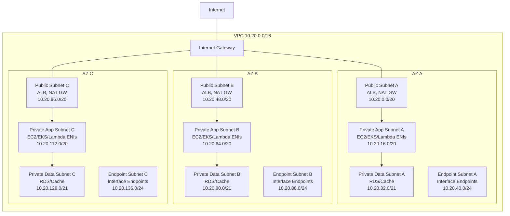


### Why These Tiers Exist


| Tier            | Internet route? | Typical resources                                                 | Reason                                      |
| --------------- | --------------- | ----------------------------------------------------------------- | ------------------------------------------- |
| Public          | Yes, to IGW     | ALB, NLB, NAT gateway, public bastion only if absolutely required | Receives or sends internet traffic          |
| Private app     | No direct IGW   | EC2, EKS nodes, ECS tasks, Lambda ENIs                            | Runs application code privately             |
| Private data    | No direct IGW   | RDS, Aurora, ElastiCache, OpenSearch, MSK                         | Stores state; only app tier should reach it |
| Endpoint/shared | No direct IGW   | Interface endpoints, shared internal services                     | Keeps AWS API calls private and controlled  |
| Inspection      | Depends         | Network Firewall, Gateway Load Balancer endpoints                 | Centralized egress/ingress inspection       |


### Route Table Pattern

Public subnet route table:

```text
10.20.0.0/16  -> local
0.0.0.0/0     -> internet-gateway
::/0          -> internet-gateway, if using IPv6
```

Private app subnet route table in AZ A:

```text
10.20.0.0/16  -> local
0.0.0.0/0     -> nat-gateway-az-a
s3-prefix     -> s3-gateway-endpoint
dynamodb-prefix -> dynamodb-gateway-endpoint, if used
```

Private data subnet route table:

```text
10.20.0.0/16  -> local
```

Private-only data subnets often do not need a default route. If a database needs patching or service access, that is usually handled by the managed service plane, not by giving the database subnet internet egress.

### Naming Convention

Use names that reveal environment, region, tier, and AZ:

```text
prod-use1-vpc-main
prod-use1-subnet-public-a
prod-use1-subnet-app-a
prod-use1-subnet-data-a
prod-use1-rt-public
prod-use1-rt-app-a
prod-use1-nat-a
prod-use1-sg-alb-public
prod-use1-sg-app
prod-use1-sg-db
```

### CIDR Planning Across Environments

Avoid overlapping CIDRs from day one. It is painful to fix later, especially when you add VPC peering, Transit Gateway, VPN, Direct Connect, or GCP connectivity.

Example organization-wide plan:


| Environment     | AWS Region  | VPC CIDR      |
| --------------- | ----------- | ------------- |
| prod            | us-east-1   | 10.20.0.0/16  |
| staging         | us-east-1   | 10.21.0.0/16  |
| dev             | us-east-1   | 10.22.0.0/16  |
| prod            | us-west-2   | 10.30.0.0/16  |
| shared services | us-east-1   | 10.40.0.0/16  |
| inspection      | us-east-1   | 10.50.0.0/16  |
| GCP prod        | us-central1 | 10.120.0.0/16 |
| on-prem         | corporate   | 10.200.0.0/16 |


For large environments, use AWS VPC IP Address Manager (IPAM) to centrally allocate and track CIDRs.

## 4. Architecture 1: Classic 3-Tier Web Application

### Use Case

This is the standard architecture for applications running on EC2 instances or Auto Scaling groups:

- React/Angular/HTML frontend, or server-rendered web tier.
- API/backend service.
- Relational database.
- Optional cache, object storage, queue, and background workers.

### Reference Diagram

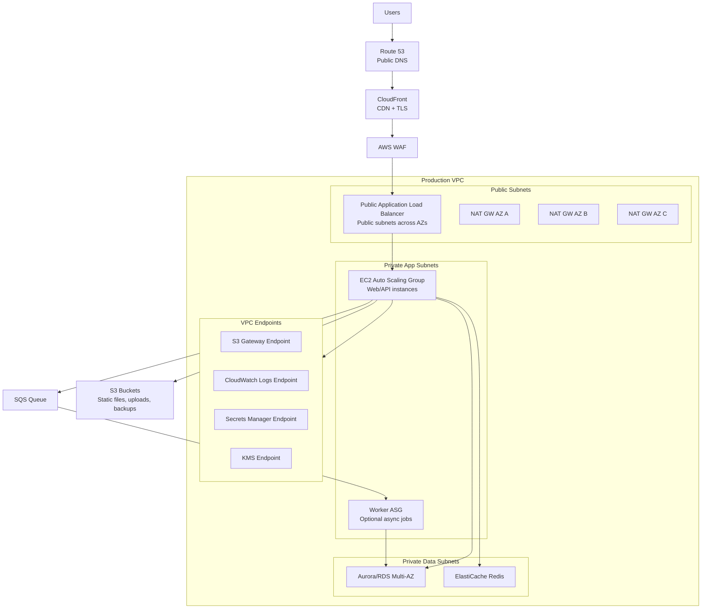


### Tier Responsibilities


| Tier    | Responsibility                           | AWS choices                            |
| ------- | ---------------------------------------- | -------------------------------------- |
| Edge    | DNS, TLS, caching, WAF, DDoS absorption  | Route 53, CloudFront, ACM, WAF, Shield |
| Ingress | Request routing to healthy app instances | ALB, NLB                               |
| Web/app | Business logic                           | EC2 Auto Scaling Group, ECS, EKS       |
| Data    | Durable state                            | Aurora/RDS, DynamoDB, S3               |
| Cache   | Low-latency ephemeral state              | ElastiCache Redis/Valkey, Memcached    |
| Async   | Decoupling, retries, buffering           | SQS, SNS, EventBridge, Step Functions  |
| Ops     | Logs, metrics, traces, audit             | CloudWatch, X-Ray, CloudTrail, Config  |


### Request Flow

1. User resolves `app.example.com` through Route 53.
2. Route 53 points to CloudFront or directly to the ALB.
3. CloudFront terminates TLS at the edge, applies caching behavior, and forwards dynamic requests.
4. AWS WAF inspects HTTP/S requests.
5. ALB receives the request in public subnets.
6. ALB forwards to healthy EC2 targets in private app subnets.
7. App instances query RDS/Aurora in private data subnets.
8. App instances use Redis for cache/session/rate-limit data if needed.
9. App publishes async work to SQS/EventBridge.
10. Workers consume messages and update data stores.

### Load Balancer Choice

Use ALB when you need:

- HTTP/HTTPS routing.
- Host-based routing.
- Path-based routing.
- Header/query routing.
- TLS termination.
- WebSocket support.
- AWS WAF integration.
- Lambda targets.

Use NLB when you need:

- TCP/UDP/TLS pass-through.
- Very high connection scale.
- Static IPs per AZ.
- Preserving client IP more directly.
- PrivateLink endpoint services.

For normal web applications, ALB is usually the default.

### EC2 Auto Scaling Design

Use an Auto Scaling group spread across private app subnets in at least two AZs. Use a launch template with:

- Hardened AMI.
- IAM instance profile with least privilege.
- Systems Manager Agent.
- CloudWatch Agent or OpenTelemetry collector.
- No SSH from internet.
- User data only for bootstrap, not complex deployment logic.

Scaling policies:

- CPU or memory target tracking.
- ALB request count per target.
- Queue depth for workers.
- Custom application metrics where useful.

### Database Design

Use managed databases unless you have a strong reason not to.

For relational workloads:

- Amazon Aurora PostgreSQL/MySQL for cloud-native relational workloads.
- Amazon RDS for PostgreSQL, MySQL, MariaDB, SQL Server, Oracle, Db2 when engine compatibility matters.
- Multi-AZ deployment for high availability.
- Read replicas for read scaling.
- RDS Proxy for connection pooling when using Lambda or bursty workloads.
- Secrets Manager for credentials.
- KMS encryption at rest.

Security group pattern:

```text
ALB SG:
  inbound 443 from 0.0.0.0/0 or CloudFront origin-facing prefix list
  outbound app-port to App SG

App SG:
  inbound app-port from ALB SG
  outbound 5432 to DB SG
  outbound 6379 to Redis SG
  outbound 443 to VPC endpoints / NAT as needed

DB SG:
  inbound 5432 from App SG
  no broad inbound CIDRs
```

### Static Assets and Uploads

Do not serve large static assets from EC2 unless there is a reason. Prefer:

- S3 for object storage.
- CloudFront for global delivery.
- Presigned S3 URLs for uploads/downloads.
- S3 event notifications to EventBridge/SQS/Lambda for post-processing.

### Deployment Pattern

Good options:

- Blue/green with two target groups and weighted ALB routing.
- Rolling deployment through Auto Scaling instance refresh.
- Immutable deployments by baking AMIs.
- CodeDeploy with ALB health checks.

Avoid "SSH into servers and git pull" in production. It works until the day it really, really does not.

### When This Architecture Is Best

Choose classic 3-tier when:

- Your application is simple or moderately complex.
- Team is comfortable with EC2.
- You need predictable long-running servers.
- Kubernetes would be operationally heavier than the app deserves.
- You need VM-level control.

Avoid it when:

- You have many microservices and need advanced orchestration.
- You need rapid per-service scaling.
- You need strong workload packaging consistency.
- Your deployment model is already container-first.

## 5. Architecture 2: Web Applications Served By Kubernetes On Amazon EKS

### What EKS Changes

In a 3-tier EC2 architecture, EC2 instances are the application units. In EKS, Kubernetes pods are the application units, and EC2 instances or Fargate profiles provide capacity.

EKS has two major planes:

- AWS-managed Kubernetes control plane.
- Customer-managed data plane where pods run.

Your VPC hosts worker nodes, Fargate pods, load balancers, pod networking, and supporting services. The EKS control plane is managed by AWS and communicates with nodes through configured cluster endpoints and cross-account ENIs.

### Reference Diagram

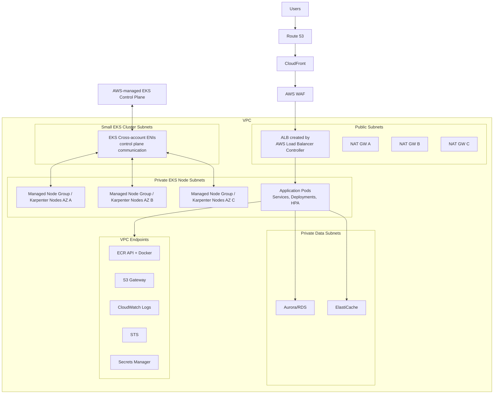


### EKS Subnet Strategy

Recommended baseline:

- Public subnets: internet-facing ALBs/NLBs and NAT gateways.
- Private node subnets: EKS managed node groups or Karpenter nodes.
- Dedicated small cluster subnets: EKS control plane ENIs, often `/28`, separate from worker node subnets.
- Private data subnets: RDS, Aurora, ElastiCache.
- Endpoint subnets: interface endpoints, if you want separation.

AWS recommends multi-AZ EKS clusters. The AWS Load Balancer Controller also needs subnets in at least two AZs for many ingress patterns.

### Public, Private, Or Private-Only EKS


| Pattern                       | Description                                                                         | When to use                  |
| ----------------------------- | ----------------------------------------------------------------------------------- | ---------------------------- |
| Public nodes                  | Nodes in public subnets with public IPs                                             | Rare; simple labs only       |
| Public ingress, private nodes | ALB in public subnets, nodes/pods in private subnets                                | Default production pattern   |
| Private-only cluster          | Internal load balancers only, private endpoint, no internet egress except endpoints | Regulated/internal platforms |


Default production choice: public ingress, private nodes.

### EKS API Endpoint Modes


| Mode                      | Meaning                                                                          | Use                          |
| ------------------------- | -------------------------------------------------------------------------------- | ---------------------------- |
| Public endpoint only      | Kubernetes API reachable publicly, with optional CIDR restrictions               | Simple, but less private     |
| Public + private endpoint | Internal node traffic uses private path; admins can still access public endpoint | Common default for teams     |
| Private endpoint only     | Kubernetes API reachable only from VPC/connected networks                        | Strict security environments |


For production, use public + private with strict public CIDR allowlists, or private-only if you have VPN/Direct Connect/SSM/bastion-style private admin access.

### Kubernetes Ingress On AWS

The AWS Load Balancer Controller watches Kubernetes resources and creates AWS load balancers:


| Kubernetes resource                              | AWS load balancer         |
| ------------------------------------------------ | ------------------------- |
| `Ingress`                                        | Application Load Balancer |
| `Service type: LoadBalancer`                     | Network Load Balancer     |
| `Gateway API` with supported controller versions | Application Load Balancer |


Example high-level routing:

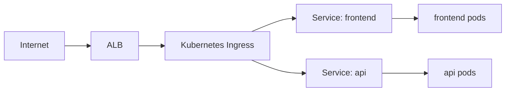


### Pod Networking

With the default Amazon VPC CNI, pods receive IP addresses from VPC subnets. This makes pod networking feel native to AWS, but it also means subnet IP exhaustion is a real design concern.

Plan for:

- Number of nodes.
- Maximum pods per node.
- Surge during deployments.
- Horizontal Pod Autoscaler events.
- Karpenter or Cluster Autoscaler scale-out.
- Separate pod CIDR/custom networking if needed.
- IPv6 or prefix delegation for larger pod density.

If your private node subnets are too small, the cluster will fail in the least glamorous way possible: not enough IP addresses.

### EKS Capacity Choices


| Capacity type       | Description                                     | Use                                                 |
| ------------------- | ----------------------------------------------- | --------------------------------------------------- |
| Managed node groups | AWS-managed lifecycle for EC2 worker nodes      | Standard workloads                                  |
| Self-managed nodes  | You own node lifecycle                          | Specialized needs                                   |
| Karpenter           | Dynamic node provisioning based on pending pods | Efficient, flexible scaling                         |
| Fargate             | Serverless pod runtime                          | Isolation, low ops, spiky workloads, system add-ons |
| Spot nodes          | Discounted interruptible EC2                    | Fault-tolerant workloads                            |


Common pattern:

- Managed node group for baseline/system capacity.
- Karpenter for elastic workload capacity.
- Spot for stateless/background workloads.
- On-Demand for critical services.

### EKS IAM

Use fine-grained IAM for workloads:

- IRSA: IAM Roles for Service Accounts.
- EKS Pod Identity where available and appropriate.
- Separate IAM role per service account.
- No broad node instance role permissions.
- Restrict instance metadata access from pods where possible.

Example:

```text
service-a Kubernetes service account -> IAM role allowing only s3:GetObject on one bucket prefix
service-b Kubernetes service account -> IAM role allowing only sqs:SendMessage to one queue
```

### EKS Security Controls

Use layers:

- Kubernetes RBAC for cluster permissions.
- IAM for AWS API permissions.
- Security groups for node/load balancer/database boundaries.
- Security groups for pods where needed.
- Kubernetes NetworkPolicies with a compatible policy engine.
- Pod Security Standards.
- Image scanning in ECR.
- Admission control using Kyverno, OPA Gatekeeper, or managed policy tooling.
- Secrets Manager or External Secrets Operator instead of raw long-lived secrets.
- CloudTrail for AWS API audit.
- Kubernetes audit logs where required.

### EKS Data Access

Pods should not connect to databases using hardcoded credentials. Prefer:

- Secrets Manager for credentials.
- External Secrets Operator to sync to Kubernetes secrets if needed.
- RDS IAM authentication where appropriate.
- RDS Proxy for connection pooling.
- TLS to database.
- Security group rules from app/pod security group to DB security group.

### EKS Observability

Minimum production set:

- Container logs to CloudWatch Logs, OpenSearch, or a third-party platform.
- Metrics via CloudWatch Container Insights, Prometheus, or managed Prometheus.
- Distributed tracing through AWS X-Ray, OpenTelemetry, or a vendor.
- ALB access logs to S3.
- VPC Flow Logs.
- EKS control plane logs for API/audit/authenticator/controller-manager/scheduler as needed.
- Alerts for pod crash loops, HPA saturation, node pressure, failed deployments, ingress 5xx, and database saturation.

### When EKS Is Best

Choose EKS when:

- You run many services.
- You need Kubernetes portability or ecosystem tooling.
- Teams already package workloads as containers.
- You need advanced deployment patterns.
- You need service mesh, admission control, custom controllers, or Kubernetes-native platform APIs.

Avoid EKS when:

- You have one simple app and no Kubernetes skills.
- You cannot staff cluster operations.
- Lambda/ECS/App Runner would solve the problem with less machinery.

## 6. Architecture 3: EKS Web Applications Integrated With Lambda And Other AWS Services

### Why Combine Kubernetes And Lambda?

Kubernetes is good for long-running services, custom runtimes, internal APIs, and workloads needing precise control. Lambda is good for event-driven, bursty, short-lived, operationally simple functions.

Use both when each does what it is naturally good at:

- EKS handles web/API services.
- Lambda handles async tasks, file processing, webhooks, glue code, scheduled jobs, event reactions, and bursty operations.

### Reference Diagram

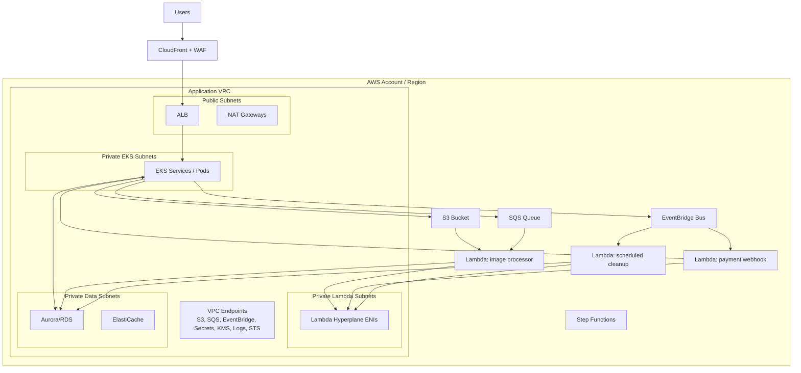


### Common Integration Patterns

#### Pattern A: EKS Publishes Events, Lambda Consumes

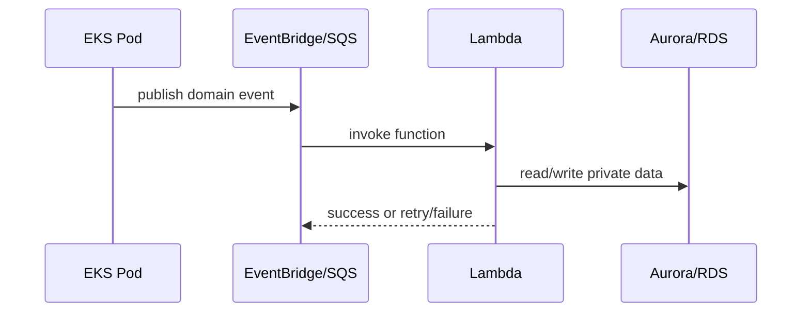


Use this for:

- Email notifications.
- Webhook fanout.
- Image/video processing.
- Audit enrichment.
- Data synchronization.
- Search index updates.

#### Pattern B: API Gateway + Lambda Beside EKS

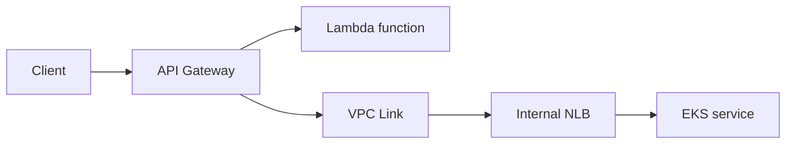


Use this when:

- Some APIs are lightweight and serverless.
- Some APIs are Kubernetes services.
- You want API Gateway features: usage plans, request validation, custom authorizers, throttling, API keys, or private APIs.

#### Pattern C: ALB Routes To EKS And Lambda

ALB can route some paths to EKS targets and other paths to Lambda targets.

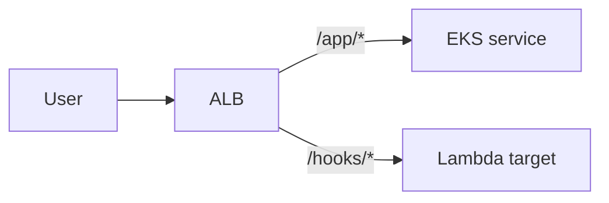


Use this for simple HTTP routing when API Gateway is not required.

#### Pattern D: Step Functions Coordinates EKS And Lambda

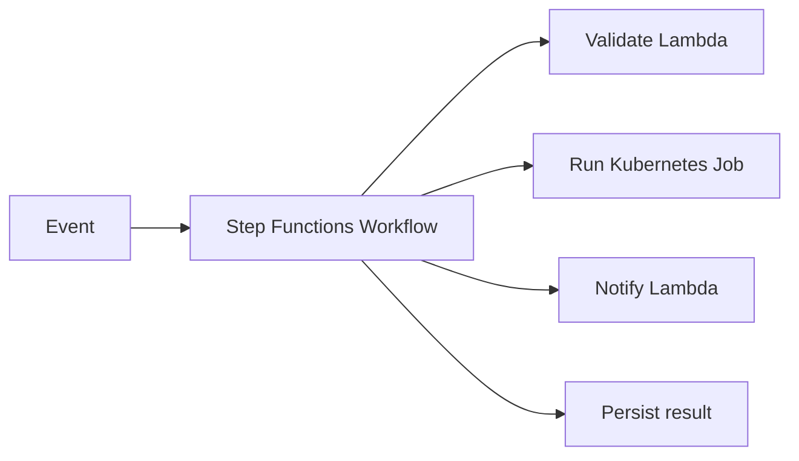


Use this for orchestrated workflows with retries, branching, human approval, or long-running jobs.

### Lambda VPC Design

By default, Lambda functions can access the public internet but cannot access private VPC resources. When a Lambda function needs private resources such as RDS, ElastiCache, private EKS services, or internal APIs, attach it to private subnets and security groups.

Important Lambda VPC points:

- Attach Lambda to private subnets, not public subnets.
- A VPC-attached Lambda does not automatically get internet access.
- If it needs public internet egress, route its private subnet to a NAT gateway.
- If it only needs AWS APIs, prefer VPC endpoints.
- Lambda uses managed Hyperplane ENIs for VPC access.
- Reuse subnet/security group combinations across functions to improve ENI reuse.
- Use RDS Proxy for relational database connections from Lambda.

Security group pattern:

```text
Lambda SG:
  outbound 5432 to DB SG
  outbound 443 to VPC endpoints

DB SG:
  inbound 5432 from App SG
  inbound 5432 from Lambda SG
```

### Eventing Choices


| Service              | Use when                                                                                                |
| -------------------- | ------------------------------------------------------------------------------------------------------- |
| SQS                  | You need durable queues, retries, backpressure, worker consumption                                      |
| SNS                  | You need pub/sub fanout to multiple subscribers                                                         |
| EventBridge          | You need event bus routing, SaaS/AWS events, schema-like event patterns                                 |
| Kinesis              | You need ordered high-throughput streams                                                                |
| Step Functions       | You need workflow orchestration, state, retries, branching                                              |
| Lambda direct invoke | You need simple synchronous/asynchronous function call, but avoid tight coupling when events are better |


### Avoiding Tight Coupling

Do not make every pod call every Lambda directly. Prefer event contracts:

```text
OrderCreated -> EventBridge -> invoice Lambda, email Lambda, analytics Lambda
```

This gives you:

- Independent retries.
- Independent deployment.
- Easier fanout.
- Better failure isolation.
- More auditability.

### Private EKS Service Access From Lambda

Options:

1. Internal NLB in private subnets pointing to Kubernetes service.
2. Internal ALB created by AWS Load Balancer Controller.
3. Private API Gateway VPC Link to NLB.
4. Service discovery with Cloud Map, if appropriate.

Keep the security boundary explicit. Lambda should call a stable internal endpoint, not random pod IPs.

## 7. Architecture 4: EKS + Lambda On AWS Integrated With GCP BigQuery And Cloud Run Functions

### The Real Design Question

When AWS applications use GCP services, first decide whether the integration is:

1. API-level integration over public service endpoints.
2. Private network integration between AWS and GCP.
3. Data pipeline integration through storage/events.
4. Identity federation integration without long-lived keys.

Do not jump straight to Direct Connect + Cloud Interconnect unless you need private, high-throughput, predictable network paths. Many BigQuery integrations work perfectly over public Google APIs using strong identity and TLS.

### Reference Hybrid Diagram

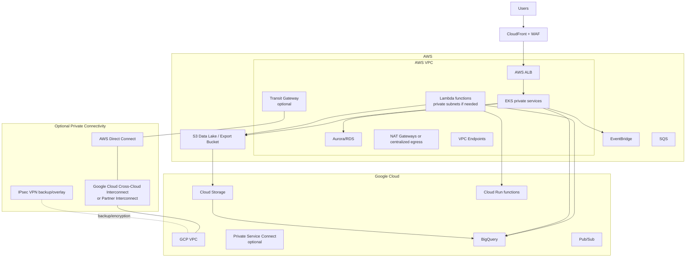


### Integration Option 1: Public Google APIs With Strong Identity

This is the simplest and often best option.

AWS workloads call:

- BigQuery API over HTTPS.
- Cloud Run function HTTPS endpoint.
- Pub/Sub API.
- Cloud Storage API.

AWS egress path:

```text
EKS/Lambda private subnet -> NAT gateway or centralized egress -> internet -> Google API endpoint
```

Security controls:

- TLS.
- Google IAM.
- Workload Identity Federation from AWS to GCP, where possible.
- No long-lived Google service account keys.
- Egress allowlisting using NAT gateway Elastic IPs or centralized firewall IPs if GCP-side allowlisting is required.
- Secrets Manager only if a credential cannot be avoided.

Use this when:

- Data volumes are moderate.
- Latency requirements are normal.
- You do not require private routing.
- You want lower operational complexity.

### Integration Option 2: Private AWS-GCP Network Connectivity

Use private connectivity when:

- Large data volumes move frequently.
- You need predictable latency or bandwidth.
- You have regulatory requirements to avoid public internet paths.
- You already have enterprise network hubs.
- Private IP access to services matters.

Possible designs:

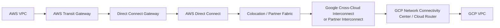


Routing:

- AWS advertises selected VPC CIDRs through TGW/DX.
- GCP advertises selected VPC CIDRs through Cloud Router.
- Avoid overlapping CIDRs.
- Use BGP route filtering.
- Keep prod/non-prod routing separated.
- Use backup VPN if availability requirements demand it.

Encryption:

- Direct Connect and Cloud Interconnect are private connections, but not automatically end-to-end encrypted in all designs.
- Use MACsec where supported or IPsec VPN over private connectivity for encryption requirements.
- Application-layer TLS should still be used.

### Integration Option 3: Data Pipeline Through Storage

For analytics, this is often cleaner than synchronous API calls.

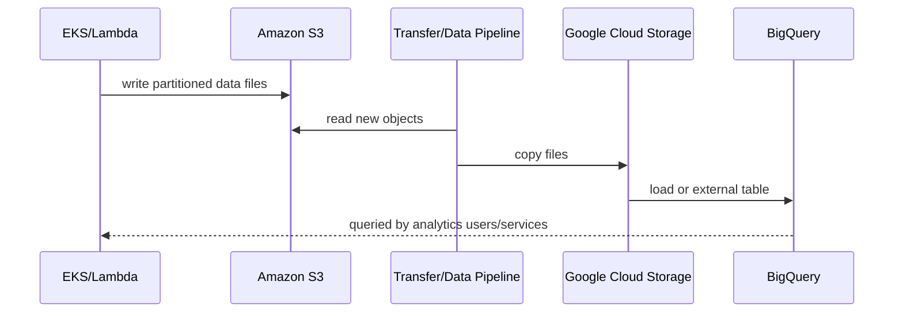


Use this when:

- BigQuery is for analytics, not request-path transactions.
- You can tolerate batch or micro-batch latency.
- You want cheaper and more reliable data movement.
- You need replayable data.

Data format recommendations:

- Use Parquet or Avro for analytics.
- Partition by event date/time.
- Compress files.
- Keep object sizes reasonably large for analytics efficiency.
- Add schema evolution rules.
- Track load jobs and dead-letter failures.

### Integration Option 4: Event Bridge Between Clouds

AWS event to GCP function:

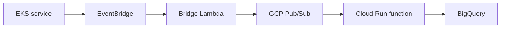


GCP event to AWS:

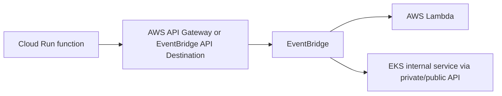


Use event bridges when:

- Systems should be decoupled.
- Retries and dead-letter queues matter.
- You need audit trails.
- You want to avoid synchronous cross-cloud dependencies in the user request path.

### BigQuery In Request Path: Be Careful

BigQuery is a serverless analytics platform. It is excellent for analytical queries, reporting, ML features, large scans, and data warehouse workloads. It is usually not the right primary request-path database for a user-facing web app.

Better patterns:

- Write operational data to Aurora/DynamoDB first.
- Publish events.
- Load data into BigQuery asynchronously.
- Query BigQuery for analytics dashboards, recommendations, fraud features, or internal tools.
- Cache derived results in DynamoDB/Redis/S3 if the application needs low-latency reads.

### Calling Cloud Run Functions From AWS

Cloud Run functions are the recommended current model for Google Cloud functions. You can call them from AWS over HTTPS or through private connectivity, depending on exposure.

Security options:

- Public HTTPS endpoint requiring IAM-authenticated identity token.
- Public HTTPS endpoint with additional application auth.
- Private ingress with GCP network controls where feasible.
- API Gateway or load balancer in front for policy control.

From AWS:

- Lambda or EKS pod obtains appropriate GCP credentials through Workload Identity Federation or a controlled secret.
- Call Cloud Run function over HTTPS.
- Use timeouts and retries carefully.
- Use idempotency keys.
- Do not block user requests on cross-cloud functions unless the latency and availability impact is acceptable.

### Identity Federation Between AWS And GCP

Avoid storing GCP service account JSON keys in AWS if possible. Prefer Workload Identity Federation:

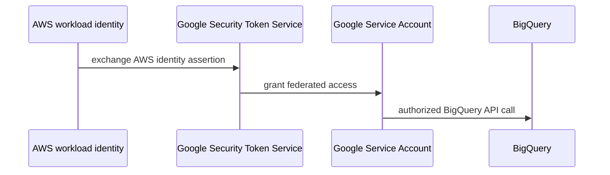


Benefits:

- No long-lived GCP keys in AWS.
- Central revocation.
- Auditable identity mapping.
- Least privilege per workload.

If you must use service account keys:

- Store them in AWS Secrets Manager.
- Rotate them.
- Restrict IAM permissions.
- Restrict secret read access to one workload role.
- Audit every access.

## 8. Centralized Network Architectures

As environments grow, you usually move from "one VPC per app" to a multi-account network.

### Multi-Account Baseline

Common AWS accounts:


| Account               | Purpose                                          |
| --------------------- | ------------------------------------------------ |
| Management            | AWS Organizations, Control Tower                 |
| Log archive           | Central logs, immutable retention                |
| Security tooling      | GuardDuty, Security Hub, audit access            |
| Network               | Transit Gateway, Direct Connect, DNS, inspection |
| Shared services       | CI/CD, artifact repositories, internal tools     |
| Prod app accounts     | Production workloads                             |
| Non-prod app accounts | Dev/test/staging workloads                       |


### Hub-And-Spoke With Transit Gateway

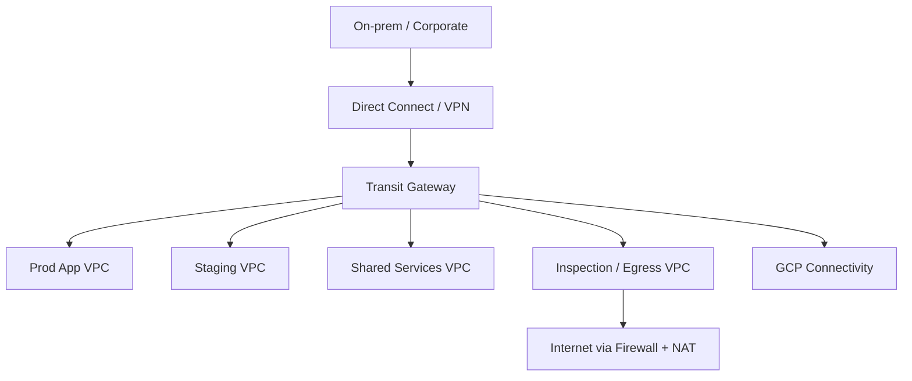


### Centralized Egress

Instead of every VPC having NAT gateways and direct internet egress, route outbound traffic through an inspection VPC:

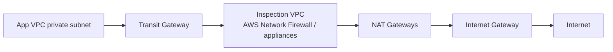


Benefits:

- Central policy enforcement.
- Central logging.
- Fewer public egress points.
- Easier IP allowlisting for SaaS/GCP.

Tradeoffs:

- More routing complexity.
- Potential bottlenecks if poorly sized.
- Inter-AZ and data processing costs.
- Blast radius of shared egress must be designed carefully.

### Centralized Ingress

Centralized ingress can be useful, but be careful. For many teams, per-application ALBs with shared WAF policies are simpler. Central ingress is more attractive when you need:

- Shared edge policy.
- Central API gateway.
- Central TLS/domain management.
- Inspection appliances.
- Strict platform team control.

## 9. Security Architecture

### Defense In Depth

Security should not depend on one control. Layer controls:

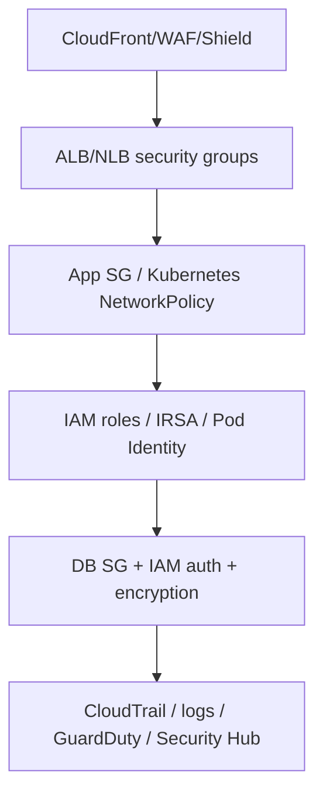


### Network Security Rules

Recommended posture:

- Only load balancers in public subnets.
- No public IPs on app nodes.
- No public databases.
- No SSH from internet.
- Use Systems Manager Session Manager for EC2 access.
- Use private EKS endpoint or restricted public endpoint.
- Use security group references, not broad CIDRs.
- Use VPC endpoints for AWS APIs.
- Use centralized egress for strict environments.
- Enable VPC Flow Logs.

### IAM Rules

Use:

- One role per workload.
- Least privilege policies.
- IAM Access Analyzer.
- Short-lived credentials.
- No static AWS keys in pods or instances.
- IRSA or Pod Identity for EKS.
- Execution roles for Lambda.
- Permission boundaries for platform environments.
- Service control policies at AWS Organizations level.

### Secrets

Use:

- AWS Secrets Manager for database credentials and external API secrets.
- AWS Systems Manager Parameter Store for lower-sensitivity configuration.
- KMS customer-managed keys where needed.
- Rotation for credentials.
- External Secrets Operator or CSI driver for Kubernetes integration.

Avoid:

- Committing `.env` files.
- Baking secrets into container images.
- Long-lived cloud provider keys.
- Shared database passwords across services.

### Data Protection

Minimum:

- TLS in transit.
- KMS encryption at rest for S3, RDS, EBS, EFS, DynamoDB, SQS, SNS, logs.
- S3 Block Public Access.
- S3 bucket policies restricting access.
- RDS deletion protection in production.
- Backup policies.
- Cross-Region backup if disaster recovery requires it.

## 10. Reliability And Availability

### Multi-AZ Design

Production services should span at least two AZs:

- ALB enabled in at least two public subnets.
- App compute across at least two private subnets.
- NAT gateway per AZ.
- RDS/Aurora Multi-AZ.
- Redis replication group across AZs where needed.
- EKS node groups or Karpenter across AZs.
- Pod topology spread constraints.

### Failure Scenarios To Design For


| Failure                  | Design response                                                    |
| ------------------------ | ------------------------------------------------------------------ |
| One app instance dies    | Auto Scaling / Kubernetes replaces it                              |
| One pod crashes          | Deployment/ReplicaSet restarts it                                  |
| One AZ impaired          | Load balancer routes to healthy AZs; app capacity exists elsewhere |
| NAT gateway failure      | Per-AZ NAT and route isolation                                     |
| Database primary failure | RDS/Aurora failover                                                |
| Bad deployment           | Blue/green, canary, rollback                                       |
| Queue consumer outage    | SQS retains messages; DLQ captures poison messages                 |
| GCP unavailable          | Async retry, circuit breaker, degraded mode                        |
| Direct Connect down      | Redundant DX and/or VPN backup                                     |


### Cross-Region Disaster Recovery

You do not always need active-active multi-Region. Choose based on RTO and RPO.


| Pattern            | RTO/RPO               | Cost        | Use                             |
| ------------------ | --------------------- | ----------- | ------------------------------- |
| Backup and restore | Hours                 | Low         | Non-critical workloads          |
| Pilot light        | Tens of minutes/hours | Medium-low  | Important workloads             |
| Warm standby       | Minutes               | Medium-high | Critical workloads              |
| Active-active      | Seconds/minutes       | High        | Global mission-critical systems |


For many applications, a well-tested single-Region multi-AZ design is more valuable than an elaborate multi-Region architecture nobody has ever failed over.

## 11. Observability And Operations

### Logs

Collect:

- Application logs.
- ALB/NLB access logs.
- CloudFront logs.
- WAF logs.
- VPC Flow Logs.
- EKS control plane logs.
- Kubernetes pod logs.
- Lambda logs.
- RDS logs where applicable.
- CloudTrail management and data events.

### Metrics

Track:

- Request rate, latency, errors.
- ALB target 5xx and load balancer 5xx.
- CPU/memory.
- Pod restarts and pending pods.
- Node pressure.
- Queue age and depth.
- Lambda duration, errors, throttles, concurrent executions.
- DB CPU, connections, locks, storage, replica lag.
- NAT gateway bytes and connection errors.
- Cross-cloud call latency/error rate.

### Tracing

Use OpenTelemetry or AWS X-Ray-compatible tracing across:

- CloudFront/ALB request IDs.
- EKS services.
- Lambda functions.
- Database calls.
- External GCP calls.
- Async message IDs.

For event-driven systems, propagate correlation IDs through events.

## 12. Cost Design

Major cost drivers:

- NAT gateway hourly and data processing charges.
- Cross-AZ data transfer.
- Load balancer LCU/NLCU usage.
- EKS cluster and node compute.
- Overprovisioned EC2 nodes.
- RDS/Aurora instance size and I/O.
- CloudWatch log ingestion and retention.
- Data transfer to internet or between clouds.
- BigQuery query scan volume.

Cost controls:

- Use VPC endpoints to reduce NAT traversal for AWS APIs.
- Use per-AZ routing to avoid cross-AZ NAT traffic.
- Use Graviton instances where supported.
- Use Karpenter or Cluster Autoscaler.
- Use Spot for tolerant workloads.
- Set CloudWatch log retention.
- Partition and cluster BigQuery tables.
- Use Parquet/Avro for analytics.
- Cache expensive query results.
- Put budgets and anomaly detection in place.

## 13. Decision Matrix

### Compute Choice


| Requirement                                  | Recommended service               |
| -------------------------------------------- | --------------------------------- |
| Simple web app, few services                 | EC2 ASG, ECS, or App Runner       |
| Container app without Kubernetes requirement | ECS/Fargate                       |
| Many services, Kubernetes ecosystem          | EKS                               |
| Short event-driven task                      | Lambda                            |
| Long workflow with state                     | Step Functions + Lambda/ECS/EKS   |
| Batch jobs                                   | AWS Batch, EKS Jobs, or ECS tasks |


### Connectivity Choice


| Need                                                | Recommended option                                |
| --------------------------------------------------- | ------------------------------------------------- |
| Private resources need outbound internet            | NAT gateway                                       |
| Private resources need AWS APIs                     | VPC endpoints                                     |
| Two or three VPCs only                              | VPC peering                                       |
| Many VPCs/on-prem networks                          | Transit Gateway                                   |
| Expose one service privately to another VPC/account | PrivateLink                                       |
| Corporate network to AWS quickly                    | Site-to-Site VPN                                  |
| Predictable private bandwidth to AWS                | Direct Connect                                    |
| AWS to GCP private high-throughput path             | Direct Connect + Cross-Cloud/Partner Interconnect |
| AWS to GCP moderate API calls                       | Public HTTPS APIs + identity federation           |


### Database Choice


| Workload                            | Recommended service                                  |
| ----------------------------------- | ---------------------------------------------------- |
| Relational transactions             | Aurora/RDS                                           |
| Key-value low-latency massive scale | DynamoDB                                             |
| Cache/session/rate limit            | ElastiCache                                          |
| Object/file/blob storage            | S3                                                   |
| Search/log analytics                | OpenSearch                                           |
| Data warehouse/analytics            | Redshift or BigQuery, depending on platform strategy |


## 14. End-To-End Example Designs

### Example A: Production 3-Tier SaaS App

Components:

- Route 53 public hosted zone.
- CloudFront distribution.
- WAF web ACL.
- Public ALB in three public subnets.
- EC2 Auto Scaling group in three private app subnets.
- Aurora PostgreSQL Multi-AZ in private data subnets.
- ElastiCache Redis in private data subnets.
- S3 for uploads.
- SQS for async jobs.
- Worker Auto Scaling group.
- VPC endpoints for S3, ECR if using containers, CloudWatch Logs, Secrets Manager, KMS, SSM.
- NAT gateway per AZ.
- CloudWatch dashboards and alarms.
- CloudTrail, GuardDuty, Security Hub.

Routing:

```text
public subnet -> 0.0.0.0/0 -> IGW
private app subnet A -> 0.0.0.0/0 -> NAT A
private app subnet B -> 0.0.0.0/0 -> NAT B
private app subnet C -> 0.0.0.0/0 -> NAT C
private data subnet -> local only
```

### Example B: Production EKS App

Components:

- EKS cluster with private worker nodes.
- Public + private EKS API endpoint with CIDR restriction, or private-only endpoint.
- Dedicated `/28` cluster subnets for EKS cross-account ENIs.
- Private node subnets sized for pod density.
- Karpenter for dynamic scaling.
- AWS Load Balancer Controller.
- ExternalDNS for Route 53 records.
- Cert-manager or ACM integration for TLS.
- IRSA/Pod Identity for AWS access.
- ECR for images.
- Secrets Manager + External Secrets Operator.
- Aurora/RDS and Redis.
- VPC endpoints for ECR, S3, CloudWatch Logs, STS, Secrets Manager, KMS.

Workload design:

- Namespaces by domain/team/environment.
- Resource requests and limits.
- HPA for services.
- PDBs for critical workloads.
- Topology spread constraints across AZs.
- Readiness/liveness/startup probes.
- Rolling or canary deployment through Argo Rollouts/Flagger or service mesh if needed.

### Example C: EKS + Lambda Event-Driven Platform

Components:

- EKS for API services.
- EventBridge for domain events.
- SQS queues for durable background work.
- Lambda functions for async processors.
- Step Functions for long workflows.
- RDS Proxy for Lambda-to-RDS.
- Shared observability and tracing.

Rules:

- User request path should not wait for non-critical Lambda work.
- Events must be versioned.
- Consumers must be idempotent.
- Every queue has a DLQ.
- Alarms on oldest message age.
- Lambda reserved concurrency where downstream protection matters.

### Example D: AWS App With GCP BigQuery Analytics

Preferred design for many teams:

- EKS/Lambda write operational data to Aurora/DynamoDB.
- Domain events go to EventBridge/SQS.
- Data export workers write partitioned Parquet to S3.
- Transfer pipeline copies S3 data to GCS or BigQuery load jobs consume external data.
- BigQuery stores analytics tables.
- Cloud Run functions handle GCP-native transformations or event reactions.
- AWS workloads query BigQuery only for analytical features, not core transactions.
- Identity uses Workload Identity Federation where possible.

High-throughput/private variant:

- AWS Transit Gateway connects app VPCs to network VPC.
- Direct Connect connects AWS to colocation/partner fabric.
- Google Cross-Cloud Interconnect or Partner Interconnect connects to GCP.
- Cloud Router exchanges routes with BGP.
- VPN over interconnect or MACsec used if encryption requirements demand it.
- Egress and DNS are centrally controlled.

## 15. Common Anti-Patterns

- Public EC2 instances running application code.
- Public RDS databases.
- One NAT gateway for multiple AZs in production.
- Tiny EKS subnets that run out of pod IPs.
- Giving every pod the node IAM role.
- Storing cloud credentials in Kubernetes secrets without rotation.
- Synchronous cross-cloud calls in critical request paths without fallback.
- Treating BigQuery as an OLTP database.
- No DLQs for async processing.
- No VPC endpoints, causing all AWS API traffic to traverse NAT.
- Overusing VPC peering until routing becomes unmanageable.
- Flat security groups allowing entire VPC CIDRs to database ports.
- No log retention controls.
- No tested restore process.
- No deployment rollback strategy.

## 16. Practical Build Checklist

### Network

- Choose Region and AZ count.
- Allocate non-overlapping VPC CIDR.
- Create public, private app, private data, and endpoint subnets per AZ.
- Attach internet gateway.
- Create route tables per tier and per AZ where needed.
- Create NAT gateway per AZ.
- Add S3/DynamoDB gateway endpoints.
- Add required interface endpoints.
- Enable VPC DNS hostnames and DNS resolution.
- Enable VPC Flow Logs.

### Security

- Define security groups by tier.
- Block public database access.
- Use IAM roles, not static keys.
- Set KMS keys and encryption requirements.
- Store secrets in Secrets Manager.
- Enable CloudTrail, GuardDuty, Security Hub, AWS Config.
- Configure WAF.
- Define backup and retention policies.

### Application

- Choose EC2/ECS/EKS/Lambda deliberately.
- Define ingress pattern.
- Define deployment pattern.
- Define autoscaling metrics.
- Define async queues/events.
- Define database connection strategy.
- Add health checks.
- Add observability.

### EKS-Specific

- Size pod subnets.
- Choose managed node groups, Karpenter, Fargate, or mix.
- Install AWS Load Balancer Controller.
- Configure IRSA/Pod Identity.
- Configure cluster endpoint mode.
- Configure ECR and required endpoints.
- Add metrics/logging/tracing.
- Add admission and policy controls.

### Hybrid AWS-GCP

- Decide API, private network, data pipeline, or event bridge integration.
- Avoid overlapping CIDRs.
- Define identity federation.
- Define egress IPs and firewall rules.
- Define DNS resolution between clouds if private.
- Define retry, timeout, and idempotency rules.
- Define data ownership and lineage.
- Monitor cross-cloud latency and cost.

## 17. Glossary


| Term         | Meaning                                                    |
| ------------ | ---------------------------------------------------------- |
| ALB          | Application Load Balancer, layer 7 HTTP/S load balancer    |
| NLB          | Network Load Balancer, layer 4 TCP/UDP/TLS load balancer   |
| AZ           | Availability Zone, isolated failure domain in a Region     |
| VPC          | Virtual Private Cloud, isolated AWS network                |
| CIDR         | IP range notation, e.g. `10.0.0.0/16`                      |
| IGW          | Internet Gateway, VPC component for internet routing       |
| NAT Gateway  | Managed NAT for outbound private subnet internet access    |
| TGW          | Transit Gateway, hub router for VPCs and external networks |
| DX           | Direct Connect, private physical connectivity to AWS       |
| VPN          | Encrypted IPsec connectivity, usually over internet        |
| PrivateLink  | Private service connectivity through interface endpoints   |
| VPC Endpoint | Private path from VPC to AWS/private services              |
| IRSA         | IAM Roles for Service Accounts in EKS                      |
| HPA          | Kubernetes Horizontal Pod Autoscaler                       |
| PDB          | Kubernetes Pod Disruption Budget                           |
| RTO          | Recovery Time Objective                                    |
| RPO          | Recovery Point Objective                                   |
| DLQ          | Dead-letter queue for failed messages                      |
| WIF          | Workload Identity Federation                               |


## 18. Source Notes

This guide is based on current AWS and Google Cloud documentation checked on 2026-06-19, plus standard production architecture practice.

Primary references:

- AWS VPC overview and core concepts: [https://docs.aws.amazon.com/vpc/latest/userguide/what-is-amazon-vpc.html](https://docs.aws.amazon.com/vpc/latest/userguide/what-is-amazon-vpc.html)
- AWS VPC subnets, route tables, internet access, VPN, VPC peering, Transit Gateway: [https://docs.aws.amazon.com/vpc/latest/userguide/how-it-works.html](https://docs.aws.amazon.com/vpc/latest/userguide/how-it-works.html)
- AWS internet gateway behavior: [https://docs.aws.amazon.com/vpc/latest/userguide/VPC_Internet_Gateway.html](https://docs.aws.amazon.com/vpc/latest/userguide/VPC_Internet_Gateway.html)
- AWS NAT gateway behavior: [https://docs.aws.amazon.com/vpc/latest/userguide/vpc-nat-gateway.html](https://docs.aws.amazon.com/vpc/latest/userguide/vpc-nat-gateway.html)
- AWS PrivateLink concepts and endpoint types: [https://docs.aws.amazon.com/vpc/latest/privatelink/what-is-privatelink.html](https://docs.aws.amazon.com/vpc/latest/privatelink/what-is-privatelink.html) and [https://docs.aws.amazon.com/vpc/latest/privatelink/concepts.html](https://docs.aws.amazon.com/vpc/latest/privatelink/concepts.html)
- AWS Transit Gateway concepts: [https://docs.aws.amazon.com/vpc/latest/tgw/what-is-transit-gateway.html](https://docs.aws.amazon.com/vpc/latest/tgw/what-is-transit-gateway.html)
- AWS Direct Connect concepts: [https://docs.aws.amazon.com/directconnect/latest/UserGuide/Welcome.html](https://docs.aws.amazon.com/directconnect/latest/UserGuide/Welcome.html) and [https://docs.aws.amazon.com/whitepapers/latest/aws-vpc-connectivity-options/aws-direct-connect.html](https://docs.aws.amazon.com/whitepapers/latest/aws-vpc-connectivity-options/aws-direct-connect.html)
- AWS Site-to-Site VPN concepts: [https://docs.aws.amazon.com/whitepapers/latest/aws-vpc-connectivity-options/aws-site-to-site-vpn.html](https://docs.aws.amazon.com/whitepapers/latest/aws-vpc-connectivity-options/aws-site-to-site-vpn.html)
- AWS multi-VPC networking whitepaper: [https://docs.aws.amazon.com/whitepapers/latest/building-scalable-secure-multi-vpc-network-infrastructure/welcome.html](https://docs.aws.amazon.com/whitepapers/latest/building-scalable-secure-multi-vpc-network-infrastructure/welcome.html)
- AWS Availability Zone fault isolation: [https://docs.aws.amazon.com/whitepapers/latest/aws-fault-isolation-boundaries/availability-zones.html](https://docs.aws.amazon.com/whitepapers/latest/aws-fault-isolation-boundaries/availability-zones.html)
- Elastic Load Balancing ALB and NLB docs: [https://docs.aws.amazon.com/elasticloadbalancing/latest/application/introduction.html](https://docs.aws.amazon.com/elasticloadbalancing/latest/application/introduction.html) and [https://docs.aws.amazon.com/elasticloadbalancing/latest/network/introduction.html](https://docs.aws.amazon.com/elasticloadbalancing/latest/network/introduction.html)
- Amazon RDS overview: [https://docs.aws.amazon.com/AmazonRDS/latest/UserGuide/Welcome.html](https://docs.aws.amazon.com/AmazonRDS/latest/UserGuide/Welcome.html)
- Amazon EKS subnet best practices: [https://docs.aws.amazon.com/eks/latest/best-practices/subnets.html](https://docs.aws.amazon.com/eks/latest/best-practices/subnets.html)
- Amazon EKS VPC/subnet requirements: [https://docs.aws.amazon.com/eks/latest/userguide/network-reqs.html](https://docs.aws.amazon.com/eks/latest/userguide/network-reqs.html)
- Amazon EKS security best practices: [https://docs.aws.amazon.com/eks/latest/best-practices/security.html](https://docs.aws.amazon.com/eks/latest/best-practices/security.html)
- Amazon EKS IRSA: [https://docs.aws.amazon.com/eks/latest/userguide/iam-roles-for-service-accounts.html](https://docs.aws.amazon.com/eks/latest/userguide/iam-roles-for-service-accounts.html)
- AWS Load Balancer Controller on EKS: [https://docs.aws.amazon.com/eks/latest/userguide/aws-load-balancer-controller.html](https://docs.aws.amazon.com/eks/latest/userguide/aws-load-balancer-controller.html)
- EKS PrivateLink endpoint access: [https://docs.aws.amazon.com/eks/latest/userguide/vpc-interface-endpoints.html](https://docs.aws.amazon.com/eks/latest/userguide/vpc-interface-endpoints.html)
- Lambda VPC configuration and Hyperplane ENIs: [https://docs.aws.amazon.com/lambda/latest/dg/configuration-vpc.html](https://docs.aws.amazon.com/lambda/latest/dg/configuration-vpc.html)
- AWS Well-Architected Framework: [https://docs.aws.amazon.com/wellarchitected/latest/framework/welcome.html](https://docs.aws.amazon.com/wellarchitected/latest/framework/welcome.html)
- Google BigQuery overview: [https://docs.cloud.google.com/bigquery/docs/introduction](https://docs.cloud.google.com/bigquery/docs/introduction)
- Google Cloud Run functions overview: [https://docs.cloud.google.com/functions/docs/concepts/overview](https://docs.cloud.google.com/functions/docs/concepts/overview)
- Google Cloud Interconnect overview: [https://docs.cloud.google.com/network-connectivity/docs/interconnect/concepts/overview](https://docs.cloud.google.com/network-connectivity/docs/interconnect/concepts/overview)
- Google Private Service Connect: [https://docs.cloud.google.com/vpc/docs/private-service-connect](https://docs.cloud.google.com/vpc/docs/private-service-connect)

