# Platform CI/CD and GitOps Architecture

This document describes the current working platform implementation, called **Platform v1**, and the target mature SaaS/platform operating model, called **Platform v2**.

The goal is to explain a modern cloud-native delivery platform from an architecture point of view: how code moves from pull request to production, how artifacts are built and verified, how GitOps drives Kubernetes, and how mature teams release software quickly, safely, securely, and reliably.

## Version Definitions

### Platform v1

Platform v1 is the current working implementation.

It provides a strong reusable CI/CD foundation:

- Service repositories use thin GitHub Actions wrapper workflows.
- Shared reusable workflows live in `sverma/platform-workflows`.
- Platform workflows are versioned with tags such as `v1.0.9`.
- Pull request validation is separated from release.
- Release builds one immutable container artifact.
- The same artifact digest is promoted across environments.
- Images are signed with Cosign.
- Provenance is created with GitHub artifact attestations.
- Staging is updated through GitOps.
- Production promotion verifies the staged artifact before opening a production GitOps pull request.

### Platform v2

Platform v2 is the target mature SaaS/platform operating model.

It builds on Platform v1 and adds production-grade operational controls:

- Progressive delivery with canary or blue-green rollout.
- GitOps manifest validation before changes reach Argo CD.
- Cluster-side admission enforcement for signed and attested images.
- First-class rollback workflow.
- Release observability and deployment markers.
- Path filters to avoid unnecessary releases.
- Pull request preview environments.
- Stricter least-privilege separation.
- Formal platform workflow release discipline.

## High-Level Architecture

```mermaid
flowchart TD
  Dev["Developer"] --> PR["Pull Request to Service Repo"]

  PR --> PRCI["PR CI<br/>lint, vet, unit tests, race detector,<br/>coverage gate, SAST, secret scan,<br/>dependency and vulnerability checks"]
  PR --> Preview["Optional PR Preview Environment<br/>ephemeral namespace, temporary URL,<br/>short-lived resources"]

  PRCI --> Review["Code Review<br/>branch protection, required checks,<br/>CODEOWNERS approval"]
  Preview --> Review
  Review --> Main["Merge to main"]

  Main --> PathFilter["Release Path Filter<br/>only app/build/deploy-impacting changes"]
  PathFilter --> Release["Release Workflow<br/>versioned reusable platform workflow"]

  Release --> Build["Build Container Once<br/>image tagged with version<br/>immutable image digest"]
  Build --> Scan["Image Scan and SBOM<br/>Trivy, dependency scan,<br/>software bill of materials"]
  Scan --> Sign["Cosign Keyless Signature<br/>GitHub OIDC identity"]
  Sign --> Attest["SLSA Provenance Attestation<br/>GitHub artifact attestations"]
  Attest --> Registry["Artifact Registry<br/>image@sha256 digest"]

  Attest --> StageUpdate["Update Staging GitOps<br/>structured YAML or Kustomize edit"]
  StageUpdate --> GitOpsValidate["GitOps Validation<br/>kustomize build, kubeconform,<br/>policy-as-code, Argo CD diff"]
  GitOpsValidate --> StageGit["Merge or Commit Staging Desired State"]

  StageGit --> ArgoStage["Argo CD Staging Sync"]
  ArgoStage --> StageChecks["Staging Smoke Tests<br/>synthetic checks, API checks,<br/>basic SLO validation"]
  StageChecks --> PromoteGate["Promotion Gate<br/>manual approval or automated health policy"]

  PromoteGate --> Verify["Promotion Verification<br/>staged digest check, registry lookup,<br/>Cosign signature, provenance verification"]
  Verify --> ProdPR["Production GitOps PR<br/>same image digest as staging"]

  ProdPR --> ProdValidate["Production GitOps Validation<br/>schema validation, policy checks,<br/>Argo CD diff, ownership checks"]
  ProdValidate --> ProdGit["Merge Production Desired State"]

  ProdGit --> ArgoProd["Argo CD Production Sync"]
  ArgoProd --> Rollout["Progressive Delivery<br/>canary or blue-green rollout"]
  Rollout --> Metrics["Metric Analysis<br/>error rate, latency, saturation,<br/>SLOs and business KPIs"]

  Metrics -->|healthy| Complete["Release Complete<br/>deployment marker, audit trail,<br/>release notes"]
  Metrics -->|unhealthy| Rollback["Automatic Abort or Rollback<br/>restore previous known-good digest"]

  Policy["Cluster Admission Policy<br/>verify signed and attested images<br/>Kyverno or Sigstore Policy Controller"] -.enforces.-> ArgoStage
  Policy -.enforces.-> ArgoProd

  Observe["Observability Platform<br/>metrics, logs, traces, dashboards,<br/>alerts, deployment events"] -.monitors.-> StageChecks
  Observe -.monitors.-> Metrics
  Observe -.monitors.-> Rollback
```



## Core Architecture Principle

The central principle is:

> Build once, verify once, promote the same immutable artifact through environments.

Production should not rebuild the application. Production should receive the exact image digest that was already built, scanned, signed, attested, and tested in staging.

This separates the delivery system into clear responsibilities:

- **CI proves source quality.**
- **Build creates a trusted artifact.**
- **Supply-chain controls prove artifact integrity.**
- **GitOps records desired runtime state.**
- **Argo CD reconciles Kubernetes to Git.**
- **Progressive delivery limits blast radius.**
- **Observability decides whether rollout continues.**
- **Policy prevents unsafe workloads from running.**
- **Rollback restores a known-good digest.**

## Repository Model

The platform uses a multi-repository model.

### Service Repository

Example: `sverma/gtod`

Responsibilities:

- Application source code.
- Dockerfile.
- Unit tests.
- Service-specific wrapper workflows.
- Minimal service-specific release configuration.

The service repository should not contain large duplicated CI/CD logic. It should call versioned reusable workflows from the platform workflow repository.

### Platform Workflows Repository

Example: `sverma/platform-workflows`

Responsibilities:

- Shared reusable GitHub Actions workflows.
- Common CI checks.
- Build, scan, sign, and attest logic.
- Release-to-staging logic.
- Promotion verification logic.
- Versioned workflow releases such as `v1.0.9`.

The platform workflow repository behaves like a platform product. Service repositories consume it through version tags.

### GitOps Repository

Example: `platform-infra`

Responsibilities:

- Kubernetes manifests.
- Kustomize overlays or Helm values.
- Environment-specific desired state.
- Argo CD Application or ApplicationSet definitions.
- Policy resources.
- Rollout resources.

The GitOps repository answers the question:

> What should be running in each environment?

## Platform v1 Current Implementation

Platform v1 currently includes the following capabilities.

### Thin Service Wrappers

The service repo contains small wrapper workflows:

- `pr-validation.yaml`
- `release.yaml`
- `promote.yaml`

These wrappers call reusable workflows from the platform repository:

```yaml
uses: sverma/platform-workflows/.github/workflows/reusable-ci-checks.yaml@v1.0.9
uses: sverma/platform-workflows/.github/workflows/reusable-build-sign.yaml@v1.0.9
uses: sverma/platform-workflows/.github/workflows/reusable-release.yaml@v1.0.9
uses: sverma/platform-workflows/.github/workflows/reusable-promote.yaml@v1.0.9
```

This keeps service workflows small and makes the platform behavior reusable across services.

### Pull Request Validation

Pull request validation checks whether the change is safe to merge.

Current PR validation includes:

- `gofmt`
- `go vet`
- `golangci-lint`
- unit tests
- race detector
- coverage profile
- coverage summary
- coverage artifact upload
- coverage threshold gate
- `govulncheck` in report-only mode
- Trivy filesystem scan
- Semgrep SAST
- Gitleaks secret scan
- Docker build-only check

The current coverage baseline is approximately `82.4%`, and the service enforces an `80%` threshold.

### Release Workflow

The release workflow runs on pushes to `main`.

It performs:

1. Reusable CI checks.
2. Version tag computation.
3. Container image build.
4. Image push to Artifact Registry.
5. Trivy image scan.
6. Cosign keyless image signing.
7. GitHub provenance attestation.
8. Structured staging GitOps update.
9. Staging image pin verification.
10. Staging GitOps commit.

The image is pinned as:

```text
registry/project/repository/image:tag@sha256:digest
```

The tag is useful for humans. The digest is what gives immutability.

### Promotion Workflow

Production promotion is manually triggered.

It does not rebuild the image.

It verifies:

- the requested tag and digest are well-formed;
- the exact artifact is already staged;
- the image exists in Artifact Registry;
- the Cosign signature matches the expected GitHub Actions identity;
- the GitHub provenance attestation exists and matches the expected workflow and source ref.

Then it opens a production GitOps pull request using the same image digest.

### Supply Chain Controls

Platform v1 includes several supply-chain protections:

- OIDC-based GCP authentication.
- No static cloud key in workflow YAML.
- Cosign keyless signing.
- GitHub provenance attestations.
- Signature verification before production promotion.
- Provenance verification before production promotion.
- Digest-based artifact promotion.

### Current v1 Strengths

Platform v1 is strong in:

- reusable workflow architecture;
- separation of PR validation and release;
- artifact immutability;
- supply-chain verification;
- GitOps-based deployment;
- platform workflow versioning;
- coverage threshold enforcement.

### Current v1 Limitations

Platform v1 still lacks:

- progressive production rollout;
- cluster-side admission enforcement;
- GitOps manifest validation before update;
- automatic rollback;
- release observability;
- PR preview environments;
- path filters;
- stricter PR least-privilege separation;
- formal changelog and compatibility policy for platform workflows.

## Platform v2 Target Capabilities

Platform v2 should add the following nine capabilities.

## 1. Progressive Delivery

Mature SaaS teams rarely deploy production changes to 100% of traffic immediately.

Platform v2 should use:

- Argo Rollouts;
- Flagger;
- blue-green deployment; or
- canary deployment.

Example rollout pattern:

```text
0% traffic
5% traffic for 5 minutes
25% traffic for 10 minutes
50% traffic for 10 minutes
100% traffic
```

At each step, metrics should be checked.

Useful metrics:

- HTTP 5xx rate;
- request latency;
- saturation;
- pod restart count;
- error budget burn rate;
- business KPI regression.

If metrics fail, rollout should pause or automatically abort.

## 2. GitOps Validation

Before a GitOps change is merged or committed, the platform should validate rendered manifests.

Recommended checks:

```text
kustomize build
kubeconform
policy-as-code
Argo CD diff
YAML schema validation
image reference validation
required labels and annotations
```

This prevents invalid desired state from reaching Argo CD.

GitOps validation should happen for both staging and production.

## 3. Cluster-Side Admission Enforcement

CI/CD verification is useful, but it is not enough.

The cluster should enforce that only trusted images can run.

Recommended tools:

- Kyverno;
- Sigstore Policy Controller;
- Connaisseur;
- cloud-native binary authorization systems.

Admission policy should verify:

- image comes from an approved registry;
- image is digest-pinned;
- image has a valid Cosign signature;
- signer identity matches the platform workflow;
- optionally, image has valid provenance.

This prevents someone from bypassing CI/CD and deploying an untrusted image directly to Kubernetes.

## 4. Rollback Workflow

Rollback should be a first-class workflow, not a manual scramble.

The rollback workflow should:

1. Accept a previous image tag or digest.
2. Verify the image exists.
3. Verify Cosign signature.
4. Verify provenance.
5. Open a GitOps rollback pull request.
6. Trigger Argo CD reconciliation.
7. Record a rollback event.

Rollback should use the same trust controls as promotion.

The safest rollback target is a previous known-good digest, not a mutable tag.

## 5. Release Observability

Every release should be observable.

The platform should emit:

- service name;
- environment;
- Git SHA;
- image digest;
- version tag;
- deploy timestamp;
- rollout status;
- Argo CD application link;
- dashboard link;
- logs/traces link;
- release notes link.

Observability should answer:

> What version is running, where is it running, who promoted it, and is it healthy?

Recommended integrations:

- Prometheus;
- Grafana;
- OpenTelemetry;
- Datadog;
- New Relic;
- Slack or Microsoft Teams notifications;
- PagerDuty or incident tooling.

## 6. Path Filters

Currently, a push to `main` can trigger a release even if only workflow or documentation files changed.

Platform v2 should avoid unnecessary releases using path filters.

Example:

```yaml
on:
  push:
    branches: [main]
    paths:
      - "cmd/**"
      - "internal/**"
      - "go.mod"
      - "go.sum"
      - "Dockerfile"
      - ".dockerignore"
```

This prevents building and deploying application images for changes that do not affect runtime behavior.

For monorepos, path filters are even more important.

## 7. Pull Request Preview Environments

Preview environments give reviewers and QA teams a live environment for each pull request.

Typical design:

```text
PR opened
-> build temporary image
-> deploy to namespace pr-123
-> create preview URL
-> run smoke tests
-> comment URL on PR
-> delete environment when PR closes
```

Preview environments are especially useful for:

- frontend changes;
- API contract testing;
- integration testing;
- product review;
- QA validation.

They should be isolated and short-lived.

## 8. Stricter Least Privilege

Platform v1 still has room to reduce permissions.

The PR build-only path should not request release-grade permissions such as:

- `id-token: write`;
- `attestations: write`;
- production or deployment secrets.

Platform v2 should split workflows more strictly:

- `reusable-build-only.yaml`
- `reusable-publish-sign.yaml`

The build-only workflow should:

- build locally;
- run image scan;
- avoid registry push;
- avoid signing;
- avoid cloud credentials.

The publish/sign workflow should run only after merge to trusted branches.

## 9. Platform Workflow Release Discipline

The platform workflow repository should be treated like a product.

Recommended practices:

- semantic version tags;
- immutable patch tags such as `v1.0.9`;
- optional moving major tag such as `v1`;
- release notes;
- changelog;
- migration guide;
- compatibility policy;
- deprecation policy;
- test service or sample repository;
- automated validation of platform workflows before tagging.

Service teams should know what changed before upgrading from one platform workflow version to another.

## End-to-End Flow: Pull Request

```text
1. Developer opens PR.
2. PR validation workflow starts.
3. Source checks run: format, vet, lint.
4. Unit tests run with race detector.
5. Coverage profile is generated.
6. Coverage threshold is enforced.
7. Security checks run.
8. Docker image is built locally but not pushed.
9. Optional preview environment is created.
10. Required checks pass.
11. Reviewer approves.
12. PR merges to main.
```

The pull request phase should not deploy to production or mutate production state.

## End-to-End Flow: Release to Staging

```text
1. Merge to main triggers release.
2. Path filter decides whether release is needed.
3. CI checks run again on main.
4. Version tag is computed.
5. Container image is built once.
6. Image is pushed to Artifact Registry.
7. Image is scanned.
8. Image is signed with Cosign.
9. Provenance attestation is created.
10. Staging GitOps image is updated to tag@digest.
11. GitOps validation runs.
12. Staging desired state is committed or merged.
13. Argo CD syncs staging.
14. Smoke tests and synthetic checks validate staging.
```

## End-to-End Flow: Promotion to Production

```text
1. Operator triggers production promotion.
2. Promotion workflow validates tag and digest input.
3. Workflow checks that the exact artifact is already staged.
4. Workflow verifies image exists in registry.
5. Workflow verifies Cosign signature.
6. Workflow verifies provenance attestation.
7. Workflow opens production GitOps PR.
8. Production GitOps validation runs.
9. Human or automated approval merges PR.
10. Argo CD syncs production.
11. Argo Rollouts starts progressive rollout.
12. Metrics are analyzed.
13. Rollout completes or automatically aborts.
```

## End-to-End Flow: Rollback

```text
1. Incident or bad metrics indicate release is unhealthy.
2. Rollout controller pauses or aborts rollout.
3. Rollback workflow selects previous known-good digest.
4. Workflow verifies image signature and provenance.
5. Workflow opens rollback GitOps PR or directly updates emergency rollback branch.
6. Argo CD reconciles previous digest.
7. Observability confirms recovery.
8. Incident notes capture root cause and timeline.
```

## Interview Explanation

A strong interview explanation can be:

> I would design CI/CD as a layered delivery platform. Service repositories only contain thin wrapper workflows. Shared platform workflows provide CI, build, signing, attestation, release, and promotion logic. Pull requests only validate code and build locally. After merge, the release workflow builds one immutable image, scans it, signs it with Cosign, creates provenance, and updates staging through GitOps. Promotion to production does not rebuild. It verifies that the exact digest is staged, exists in the registry, has a valid signature, and has valid provenance. Then it opens a production GitOps PR. Argo CD reconciles the cluster, and Argo Rollouts progressively shifts traffic while metrics determine whether to continue or roll back.

Another concise version:

> GitHub Actions is the automation and artifact trust layer. Artifact Registry stores immutable images. GitOps stores desired Kubernetes state. Argo CD performs reconciliation. Argo Rollouts controls blast radius. Observability and policy decide whether a release is allowed to continue.

## What Makes This Cloud Native

This model is cloud native because it uses:

- immutable artifacts;
- declarative desired state;
- Kubernetes reconciliation;
- GitOps audit trail;
- short-lived identity through OIDC;
- container signing and provenance;
- policy-as-code;
- automated rollout and rollback;
- metrics-based release decisions.

It avoids:

- SSH-based deployment;
- manually applying Kubernetes YAML;
- rebuilding separately for production;
- mutable production tags;
- long-lived cloud keys;
- unverified images;
- invisible release state.

## Platform v1 to v2 Roadmap

Recommended implementation order:

1. Add path filters to release workflows.
2. Split PR build-only from publish/sign workflow permissions.
3. Add GitOps validation before staging and production changes.
4. Add cluster admission verification for signed images.
5. Add Argo Rollouts or Flagger progressive delivery.
6. Add smoke tests and SLO-based rollout analysis.
7. Add rollback workflow.
8. Add release observability and deployment markers.
9. Add PR preview environments.
10. Add platform workflow changelog and release process.

## Current Maturity Assessment

Approximate maturity after Platform v1:

```text
CI/CD architecture:        8/10
Supply-chain hardening:    7.5/10
GitOps maturity:           6/10
Progressive delivery:      4/10
Operational maturity:      4.5/10
Enterprise platform reuse: 7/10
```

Platform v1 is not a toy pipeline. It is already a serious reusable CI/CD foundation.

Platform v2 moves it from secure automation to an operated SaaS release platform.

## Key Takeaways

- Keep service workflows thin.
- Put reusable delivery logic in a versioned platform workflow repository.
- Build once and promote the same digest.
- Use GitOps for desired state.
- Use Argo CD for reconciliation.
- Use Cosign and provenance for artifact trust.
- Verify before promotion.
- Enforce again inside the cluster.
- Roll out gradually.
- Watch metrics.
- Roll back quickly.
- Treat the platform as a product.

